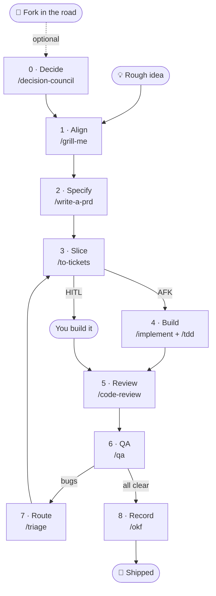

# The Project Flow

The standard every project runs on, from a fork in the road to shipped, reviewed, tested
work, with QA feeding back in as a loop and what you learned recorded at the end.

Stages 1–5 are adapted from **Matt Pocock's** [AI Hero](https://www.aihero.dev) workshop and
his [`mattpocock/skills`](https://github.com/mattpocock/skills) repo (MIT). Stage 0 is adapted
from Dave Brown's `decision-council`. The discipline layer is
[`unlazy`](https://github.com/Leonxlnx/unlazy) (MIT, Leonxlnx). This file documents *our* version
and how the pieces fit.

---

## The core idea

Most agentic-coding failures come from an agent **charging ahead on wrong assumptions**, and
most of the rest come from an agent **reporting done before it is done**. The flow fixes the
first by front-loading alignment and slicing work small. The discipline layer fixes the second
by making completion a file you check rather than a feeling you have.

1. **Diverge** before converging.
2. **Align** before specifying.
3. **Specify** before slicing.
4. **Slice** into independent, end-to-end units before building.
5. **Build** each slice against gates, keeping CI green.
6. **QA** by using the thing; route what QA finds back into the queue.
7. **Record** what the work taught you, before it goes stale.

---

## The flow at a glance

Rendered chart: [flow-chart.svg](flow-chart.svg), the same map with the design lane and wrappers, viewable anywhere.

| # | Stage | Skill | In | Out |
|---|-------|-------|----|-----|
| 0 | Decide | `/decision-council` | A fork with no obvious answer | Five lenses + the real question you're deciding |
| 1 | Align | `/grill-me` | A rough idea, or a council report | Locked decisions |
| 2 | Specify | `/write-a-prd` | Locked decisions + the codebase | `prds/<feature>.md` |
| 3 | Slice | `/to-tickets` | The PRD | Vertical slices, blocking edges, AFK/HITL, capability tier |
| 4 | Build | `/implement` + `/tdd` | One unblocked ticket | A green commit or PR |
| 5 | Review | `/code-review` | The diff | Findings, applied or filed |
| 6 | QA | `/qa` | You using the thing | Behaviour-focused issues |
| 7 | Route | `/triage` | Raw issues | `ready-for-agent` / `ready-for-human` / `needs-info` / `wontfix` |
| 8 | Record | `/okf` | What the build taught you | An indexed, validated, maintained bundle |

Stages 0–3 are a **funnel** you run once per feature. Stages 4–8 are a **loop** you run
continuously. The feature is done when a QA pass turns up nothing worth filing.

---

## The four tiers

Every skill is exactly one of these. The tier decides how it behaves, not how important it is.

| Tier | What it is | Members |
|---|---|---|
| **1 · Pipeline** | Sequenced and stateful. Hands off to the next stage and **ends by naming it**. | `decision-council` `grill-me` `write-a-prd` `to-tickets` `implement` `tdd` `qa` `triage` `okf` |
| **2 · Discipline** | Cross-cutting. Changes *how* a stage executes. **Never names a next stage**: it wraps whatever is running. | `unlazy` `code-review` `simplify` `loop` `security-review` |
| **3 · Craft** | Domain taste. Fires when the work is in that domain, silent otherwise. | `taste-skill:*` (plugin), `design`, `dataviz`, `artifact-design` |
| **4 · Knowledge** | Maintains standing context. Produces no code, takes no ticket. | `okf`, `business-memory` (content), the reference corpora |

> **The tier-1 test:** if a skill ends with a `▶ Next` breadcrumb, it's a stage. If it told you
> where to go next but wraps other work, it's mislabelled; a discipline that claims to be a
> stage will fight the stage it's wrapping.

---

## Three things that wrap the flow but are never a stage

**`unlazy`: the discipline layer.** Writes acceptance gates to a file *before* stage 4 starts
and holds stage 5 to them. Gates carry `CHECK:` commands and `EXPECT:` matches, so done is a
shell exit rather than a feeling. See "The boundary that matters" below.

**`overnight-switchboard`: the router.** Reads the capability tier stage 3 already stamped on
each ticket and picks the executor. Stage 3 is the *only* place tier is decided; the switchboard
never re-derives it.

**Standing context.** `business-memory` for the business, `design-language/` and `design-kits`
for house style. Read at stage 2 and again at stage 4. Never written by an agent mid-flow.

---

## The design lane

How design work rides the same stages, no stage of its own. Three touchpoints:

**Stage 2, define the look.** `write-a-prd`'s design step generates the mockup through
`taste-skill:imagegen-frontend-web` (one image per section) or `-mobile` (screen concepts in a
phone frame), with the `imagegen` skill as the routing authority for *how* images get made:
Hugging Face Spaces via `dynamic_space` for anything brand-bound or containing readable text
(FLUX.1-schnell is Apache-2.0; Qwen-Image for text-in-image), local SDXL for volume and
throwaway exploration. Identity work (a rename, a client brand) goes through
`taste-skill:brandkit` first.

**Stage 2 → 4, validate before building.** The approved images are the handoff, and the build
route depends on the surface:

| Surface | Route |
|---|---|
| Web code (client sites, landing pages) | `taste-skill:image-to-code` builds against the approved sections; `taste-skill` v2 + `soft-skill` set the code standards |
| Squarespace (client sites) | Images feed a buildability gate (Native / CSS / Not-possible), the prototype never bypasses it, because HTML can promise what Fluid Engine cannot deliver |
| Native app (iOS / macOS) | Concepts validate the direction only; the build is a normal stage-4 ticket in the platform's own idiom |

**Stage 5, design review.** For UI-facing tickets the review is two-part: `/code-review` for
correctness, `taste-skill:redesign-skill` for the design audit (generic-AI patterns, cheap
defaults), applied to the diff's surfaces, without breaking function.

**The rule that holds it together: house design language wins where one exists.** A product's
locked brand, an agency brand foundation, a platform's own design language, taste skills execute
*within* those. The style presets (`minimalist`, `brutalist`) are explicit-invoke
only, for work deliberately outside a house style. Purely visual changes stay on the overnight
exclusion list regardless, a wrong look is green in `xcodebuild` and still wrong.

---

## The boundary that matters: `unlazy` vs `to-tickets`

Both decompose work, and run on the same axis they will produce two competing trees over one
feature. The boundary:

- **`to-tickets` owns decomposition *across* a feature.** It produces the queue: vertical
  slices, each a complete path through every layer, each declaring what blocks it.
- **`unlazy`'s Depth Tree operates *inside* one ticket**: or replaces `to-tickets` entirely for
  work that isn't a feature: refactors, audits, doc sweeps, migrations.

Never both on the same axis.

**Local amendment (2026-08-20).** Upstream `unlazy` states its driver loop as *"dispatch one
leaf … dispatch the next leaf"*, with concurrency mentioned afterwards as something that *can*
happen. Followed literally that serialises a build. We patched `references/orchestration.md` and
`templates/PLAN.md` for **wave dispatch**: compute the set of leaves whose blockers are verified,
dispatch all of them up to the harness cap, recompute as they land. The contract's disjoint file
ownership always made this safe, it just wasn't an instruction. Parent re-verification is
unchanged and does not get cheaper because ten leaves returned at once.

---

## Entering mid-flow, realigning what's already in flight

**`/flow` is the front door.** Run it at the start of any session, on any project: it
inventories the PRDs, ticket queue, tracker labels, git state and gates, names the stage the
project is in, and hands you the one command to run next. It is read-only, the stage skills
do the work.

Most projects won't start at stage 0. The rule `/flow` applies: **enter at the first stage
whose input you don't already have:**

| What the project has | Enter at | Why |
|---|---|---|
| Code, no PRD, unclear intent | **1 · `/grill-me`** | The decisions were made implicitly in code. Surface and lock them before writing a PRD that rationalises whatever is there |
| A PRD, no tickets | **3 · `/to-tickets`** | The spec is the input it wants. Don't re-spec |
| Tickets in flight, unsure what's true | **6 · `/qa`** | Use the thing first. QA tells you what the queue should have said, then routes through 7 back into 3 |
| Shipped, undocumented | **8 · `/okf`** | Capture what it taught you before it goes stale |

---

## Two vocabularies both called "tier"

They are orthogonal and both are correct. **Never write a bare "tier" where both could be meant.**

| | Axis | Values | Set by | Read by |
|---|---|---|---|---|
| **Capability tier** | Who should attempt the work | `mechanical` · `standard` · `hard` | `/to-tickets`, `/triage` | the switchboard |
| **Permission tier** | How dangerous the action is | GREEN · YELLOW · RED | a skill's own guard | a `PreToolUse` hook |

Capability tier is keyed to **failure-detectability, not difficulty**: would a wrong answer be
caught by the gate, or would it merge green and wrong? A broad covered refactor is `mechanical`.
A one-line copy change nothing tests is `hard`. Tiers name a tier, never a model.

---

## Labels & conventions

| Label | Meaning |
|-------|---------|
| `ready-for-agent` | AFK, an agent can implement and merge unattended |
| `ready-for-human` / HITL | Needs your decision or hands |
| `needs-triage` | New, unclassified |
| `needs-info` | Waiting on the reporter |
| `wontfix` | Closed without action, reason stated |
| `bug` / `enhancement` | Category, triage assigns exactly one |
| `tier:mechanical` · `tier:standard` · `tier:hard` | Capability tier |

**Wide refactors** use expand→contract: add the new form alongside the old, migrate call sites
in batches, delete the old once unused. Keeps CI green throughout.

**Output is local-first everywhere.** Markdown files by default; a remote tracker only inside a
git repo with `gh`, always showing the draft and asking first.

---

## Status

| Stage | Skill | State |
|---|---|---|
| 0 | `decision-council` | ✅ installed 2026-08-20, adapted for Artifact output |
| 1 | `grill-me` | ✅ |
| 2 | `write-a-prd` | ✅ |
| 3 | `to-tickets` | ✅ |
| 4 | `implement` | ✅ explicit-invoke only |
| 4 | `tdd` | ✅ written 2026-08-20, closes the reference `implement` step 3 makes |
| 5 | `code-review` | ✅ harness built-in |
| 6 | `qa` | ✅ |
| 7 | `triage` | ✅ written 2026-08-20, closes the loop `/qa` opens |
| 8 | `okf` | ✅ |
|, | `unlazy` | ✅ vendored + wave-dispatch patch. **Stop hook not installed**: pending one proving run |

---

## Not part of this flow

Platform-specific tooling is a **one-off tool**, not a stage. Three patterns from that work are
borrowed here rather than run as steps: shipping a guard hook inside a plugin, treating knowledge
conformance as a tested in-repo library, and keeping a real `design-language/` a build gate reads.

---

## Sources

- [Real-world feature build with Claude Code, aihero.dev](https://www.aihero.dev/real-world-feature-build-with-claude-code)
- [mattpocock/skills (MIT)](https://github.com/mattpocock/skills)
- [Leonxlnx/unlazy (MIT)](https://github.com/Leonxlnx/unlazy)
- [Leonxlnx/taste-skill (MIT)](https://github.com/Leonxlnx/taste-skill)
- Dave Brown, `decision-council`, the business-memory template set

*Derived from the above. This document and our local skills add adaptive output, the tier
taxonomy, the mid-flow entry rule, and the wave-dispatch amendment.*
